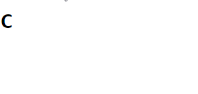
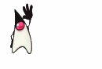
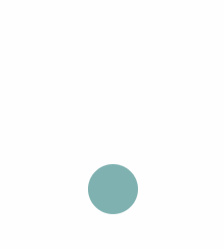
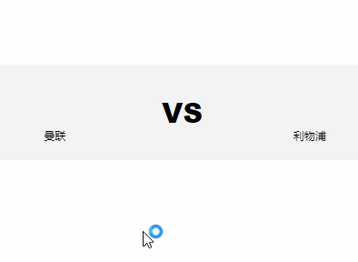
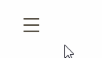
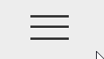
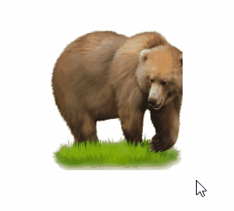
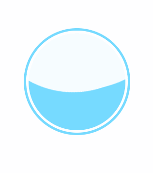
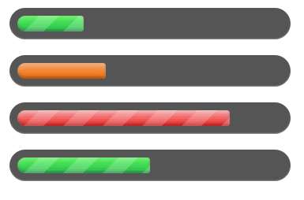

[呼吸灯](./src/breathing-light.html)

[呼吸灯](./gif/breathing-light.gif)

[正方形3D效果](./src/square-3d.html)

[正方形3D效果](./gif/square-3d.gif)

[打字效果](./src/typing.html)

[图片全景](./src/panoramic.html)

[图片转gif](./src/image-to-gif.html)

[小球掉落](./src/ball-bounce.html)

[loading加载](./src/loading.html)

[team-logo加载](./src/team-logo.html)

[menu鼠标覆盖](./src/menu-hover.html)

[menu鼠标点击](./src/menu-click.html)

[logo鼠标覆盖](./src/logo.html)

[wave波浪](./src/wave.html)

[进度条](./src/progress-bars.html)

